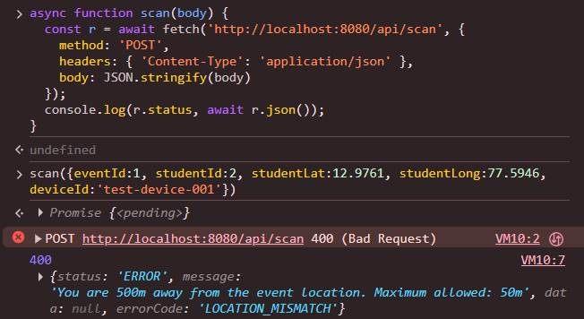
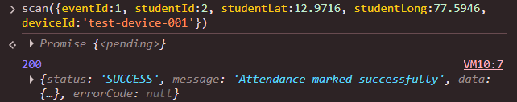
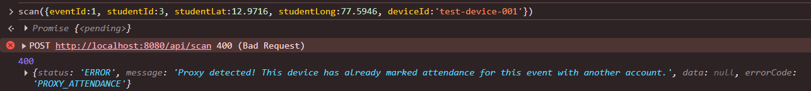
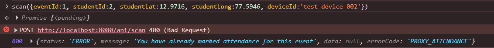
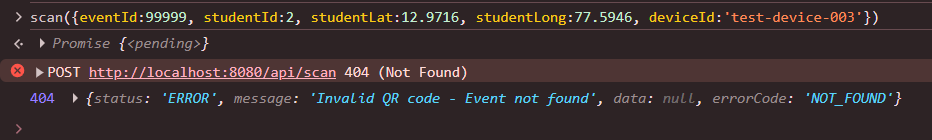

# Exception Testing

### GeoQR Attend: Security Error Handling

---

## 1. Purpose

This document records every security-related error produced by the backend, the condition that triggers it, and the response observed when the condition was tested against the running system.

---

## 2. Standard Error Format

All exceptions are intercepted by `GlobalExceptionHandler`, a class annotated with `@RestControllerAdvice`. Every error is therefore returned in the same structure.

```json
{
  "status": "ERROR",
  "message": "Description of the problem",
  "errorCode": "LOCATION_MISMATCH"
}
```

---

## 3. Order of Checks

`AttendanceService` evaluates a scan request in the following order.

| Order | Check | Exception | Error Code |
|:-----:|-------|-----------|------------|
| 1 | The event exists | `ResourceNotFoundException` | `NOT_FOUND` |
| 2 | The student has not already marked attendance | `ProxyAttendanceException` | `PROXY_ATTENDANCE` |
| 3 | The student is within the permitted radius | `LocationMismatchException` | `LOCATION_MISMATCH` |
| 4 | The device has not been used for this event | `ProxyAttendanceException` | `PROXY_ATTENDANCE` |
| 5 | All checks passed | none | `SUCCESS` |

The order matters. A student who has already marked attendance is rejected at check 2, before the location is measured.

---

## 4. Test Method

Requests were sent to `POST /api/scan` on the running backend (`http://localhost:8080`) using seeded data. The seeded event has identifier 1, latitude 12.9716, longitude 77.5946, and a radius of 50 meters. Students 2, 3, and 4 are seeded student accounts. The five tests were run in the order shown below, because each test depends on the state left by the one before it.

---

## 5. Test Results

### 5.1 LocationMismatchException

**Trigger:** the distance from the event is greater than the event radius.

**Input:** student 2 at (12.9761, 77.5946), about 500 meters north of the event.

| Item | Result |
|------|--------|
| HTTP status | 400 |
| Error code | `LOCATION_MISMATCH` |
| Message | You are 500m away from the event location. Maximum allowed: 50m |
| Outcome | Behaved as expected |



---

### 5.2 Valid Attendance (Control Test)

**Purpose:** confirm that a correct request is accepted and stored, so that the following tests have a record to conflict with.

**Input:** student 2 at (12.9716, 77.5946), device `test-device-001`.

| Item | Result |
|------|--------|
| HTTP status | 200 |
| Status field | `SUCCESS` |
| Outcome | Behaved as expected |



---

### 5.3 ProxyAttendanceException: Same Device, Different Student

**Trigger:** a device that has already been used for the event is used again by another student account.

**Input:** student 3 at the event location, using device `test-device-001`.

| Item | Result |
|------|--------|
| HTTP status | 400 |
| Error code | `PROXY_ATTENDANCE` |
| Message | Proxy detected! This device has already marked attendance for this event with another account. |
| Outcome | Behaved as expected |



---

### 5.4 ProxyAttendanceException: Duplicate Attendance

**Trigger:** the same student submits attendance for the same event a second time.

**Input:** student 2 at the event location, using a different device, `test-device-002`.

| Item | Result |
|------|--------|
| HTTP status | 400 |
| Error code | `PROXY_ATTENDANCE` |
| Message | You have already marked attendance for this event |
| Outcome | Behaved as expected |



---

### 5.5 ResourceNotFoundException: Invalid Event

**Trigger:** the request refers to an event identifier that does not exist.

**Input:** event identifier 99999.

| Item | Result |
|------|--------|
| HTTP status | 404 |
| Error code | `NOT_FOUND` |
| Message | Invalid QR code - Event not found |
| Outcome | Behaved as expected |



---

## 6. Other Handled Errors

| Situation | Exception | Error Code | HTTP Status |
|-----------|-----------|------------|:-----------:|
| Wrong email, password, or role at login | `ResourceNotFoundException` | `NOT_FOUND` | 404 |
| Any other unexpected failure | `Exception` | `INTERNAL_ERROR` | 500 |

The fallback handler ensures that the client always receives a structured error response and never a raw server error page.

---

## 7. Summary

| Test | Exception | Error Code | HTTP Status | Result |
|------|-----------|------------|:-----------:|:------:|
| 5.1 | `LocationMismatchException` | `LOCATION_MISMATCH` | 400 | Pass |
| 5.2 | none (control) | `SUCCESS` | 200 | Pass |
| 5.3 | `ProxyAttendanceException` | `PROXY_ATTENDANCE` | 400 | Pass |
| 5.4 | `ProxyAttendanceException` | `PROXY_ATTENDANCE` | 400 | Pass |
| 5.5 | `ResourceNotFoundException` | `NOT_FOUND` | 404 | Pass |